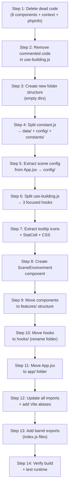

# 🏗️ Crprus-3D — Refactoring & Folder Structure Plan

## 📋 Table of Contents

1. [Current State Analysis](#current-state-analysis)
2. [Issues Identified](#issues-identified)
3. [Proposed Folder Structure](#proposed-folder-structure)
4. [Refactoring Tasks](#refactoring-tasks)
5. [Migration Steps (Execution Order)](#migration-steps)

---

## Current State Analysis

### Current Folder Structure

```
src/
├── App.css
├── App.jsx                         ← Main app (scene setup, Canvas, camera, grid, etc.)
├── index.css
├── main.jsx
├── assets/
│   └── react.svg
├── components/
│   ├── adaptive-controls/
│   │   └── index.jsx               ← OrbitControls with responsive breakpoints
│   ├── building-model/
│   │   ├── index.jsx               ← Building + hitbox renderer
│   │   └── use-building.js         ← 391-line hook (model loading, materials, hover, click, camera rotation)
│   ├── building-tooltip/
│   │   ├── index.jsx               ← DOM tooltip with inline styles (330 lines)
│   │   └── use-tooltip.js          ← Tooltip positioning logic
│   ├── camera-controller/          ← ❌ UNUSED — replaced by adaptive-controls
│   │   └── index.jsx
│   ├── camera-light/
│   │   └── index.jsx               ← Camera-following directional light
│   ├── direction-label/
│   │   ├── index.jsx               ← 3D directional NSEW labels
│   │   └── use-direction-label.js  ← Camera rotation + responsive breakpoints
│   ├── directional-arrows/         ← ❌ UNUSED — replaced by direction-label
│   │   └── index.jsx
│   ├── floor-plan/                 ← ❌ UNUSED — floor-sliding animation (not in App.jsx)
│   │   └── index.jsx
│   ├── grass-grid/                 ← ❌ UNUSED — black ground plane (not in App.jsx)
│   │   └── index.jsx
│   ├── pop-up/                     ← ❌ UNUSED — old popup (replaced by building-tooltip)
│   │   └── index.jsx
│   ├── unit-info-popup/            ← ❌ UNUSED — old sidebar popup (not in App.jsx)
│   │   └── index.jsx
│   └── use-fit-camera/             ← ⚠️ Hook in components/ — should be in hooks/
│       └── index.jsx
├── context/
│   └── ControlsContext.jsx         ← ⚠️ Unused — controlsRef is passed via props now
├── hook/                           ← ⚠️ Singular name (should be "hooks")
│   └── useDeviceDetect.js
└── utils/
    ├── constant.js                 ← unitData (205 lines) + color config + statusType enum
    └── helper.js                   ← flattenUnitData helper
```

### Tech Stack
| Library | Version |
|---------|---------|
| React | 19.2.3 |
| Three.js | 0.172.0 |
| @tabler/icons-react | _(to be installed)_ |
| @react-three/fiber | 9.5.0 |
| @react-three/drei | 10.7.7 |
| GSAP | 3.12.7 |
| Vite | 6.0.5 |

---

## Issues Identified

### 🔴 Critical

| # | Issue | Location | Impact |
|---|-------|----------|--------|
| 1 | **6 unused components** still in codebase | `camera-controller/`, `directional-arrows/`, `floor-plan/`, `grass-grid/`, `pop-up/`, `unit-info-popup/` | Dead code, confusing for devs |
| 2 | **[use-building.js](file:///e:/Utsav%20Workspace/React%20Js%20Project/crprus-3d/src/components/building-model/use-building.js) is 391 lines** — mixes model loading, material setup, pointer handlers, camera rotation animation | [building-model/use-building.js](file:///e:/Utsav%20Workspace/React%20Js%20Project/crprus-3d/src/components/building-model/use-building.js) | Hard to maintain, violates SRP |
| 3 | **[building-tooltip/index.jsx](file:///e:/Utsav%20Workspace/React%20Js%20Project/crprus-3d/src/components/building-tooltip/index.jsx) is 330 lines** with 100+ lines of inline SVG icons | [building-tooltip/index.jsx](file:///e:/Utsav%20Workspace/React%20Js%20Project/crprus-3d/src/components/building-tooltip/index.jsx) | Bloated component, hard to extend |
| 4 | **Constants file mixes data + config** — unit data (domain data), color config, and enum all in one file | [utils/constant.js](file:///e:/Utsav%20Workspace/React%20Js%20Project/crprus-3d/src/utils/constant.js) | Poor separation of concerns |

### 🟡 Moderate

| # | Issue | Location | Impact |
|---|-------|----------|--------|
| 5 | **`use-fit-camera/` is a hook stored under `components/`** | `components/use-fit-camera/` | Misleading folder structure |
| 6 | **[ControlsContext.jsx](file:///e:/Utsav%20Workspace/React%20Js%20Project/crprus-3d/src/context/ControlsContext.jsx) is unused** — `controlsRef` is now passed via props | [context/ControlsContext.jsx](file:///e:/Utsav%20Workspace/React%20Js%20Project/crprus-3d/src/context/ControlsContext.jsx) | Dead code |
| 7 | **Folder `hook/` is singular** — convention is `hooks/` | `src/hook/` | Inconsistent naming |
| 8 | **All inline styles in tooltip** — no CSS modules or external stylesheet | `building-tooltip/index.jsx` | Hard to theme/maintain |
| 9 | **Commented-out code blocks** in `use-building.js` (~100 lines) | `building-model/use-building.js` | Noise, code debt |
| 10 | **`phpinfo.php` in project root** | Root | Artifact/security risk |

### 🟢 Minor

| # | Issue | Location | Impact |
|---|-------|----------|--------|
| 11 | **`App.jsx` has hardcoded scene config** (camera pos, HDR URL, Grid params) | `App.jsx` | Should be externalized |
| 12 | **No `index.js` barrel exports** in directories | Various | Verbose import paths |
| 13 | **Inconsistent file naming** — some use kebab-case folders with camelCase files | Various | Convention mismatch |

---

## Proposed Folder Structure

```
src/
├── main.jsx                          # Entry point (unchanged)
│
├── app/                              # 🆕 App root
│   ├── App.jsx                       # Root component — just <Canvas> + providers
│   └── App.css                       # Global app styles
│
├── components/                       # Shared / reusable components
│   └── ui/                           # 🆕 DOM-based UI components
│       └── tooltip/
│           ├── BuildingTooltip.jsx    # Tooltip layout
│           ├── BuildingTooltip.css    # Extracted tooltip styles
│           └── StatCell.jsx           # Stat cell sub-component
│
├── features/                         # 🆕 Feature-based modules
│   ├── building/                     # Everything related to 3D building
│   │   ├── BuildingModel.jsx         # Presentation component (group + primitives)
│   │   ├── useBuilding.js            # Model loading + scene setup only
│   │   ├── useBuildingInteraction.js  # 🆕 Pointer handlers (hover, click)
│   │   └── useCameraRotation.js      # 🆕 Extracted click-to-rotate animation
│   │
│   ├── controls/                     # Camera & controls
│   │   └── AdaptiveControls.jsx      # OrbitControls with breakpoints
│   │
│   ├── environment/                  # 🆕 Scene environment (lights, HDR, grid)
│   │   └── SceneEnvironment.jsx      # HDR + Grid + EffectComposer bundle
│   │
│   ├── direction/                    # Direction labels
│   │   ├── DirectionLabel.jsx        # Billboard text labels
│   │   └── useDirectionLabel.js      # Camera movement + positions
│   │
│   └── lighting/                     # 🆕 Lighting
│       └── CameraLight.jsx           # Camera-following light
│
├── hooks/                            # 🆕 Renamed from "hook/" — global hooks
│   ├── useDeviceDetect.js            # Device breakpoint detection
│   ├── useFitCamera.js              # 🆕 Moved from components/use-fit-camera/
│   └── useTooltip.js                 # 🆕 Moved from building-tooltip/
│
├── data/                             # 🆕 Static / domain data
│   └── unitData.js                   # Unit definitions (Box001–Box020)
│
├── config/                           # 🆕 App-wide configuration
│   ├── scene.config.js               # Camera position, HDR path, Grid params
│   ├── colors.config.js              # UNIT_COLORS, status config, OUTLINE_KEY
│   └── breakpoints.config.js         # Shared breakpoint definitions
│
├── constants/                        # 🆕 Enums & magic values
│   └── status.js                     # statusType enum
│
├── utils/                            # Pure utility functions
│   └── helpers.js                    # flattenUnitData + future helpers
│
├── styles/                           # 🆕 Global stylesheets
│   ├── index.css                     # CSS reset + variables
│   └── tooltip.css                   # Tooltip-specific styles
│
└── assets/                           # Static assets
    └── react.svg
```

---

## Refactoring Tasks

### Phase 1 — Cleanup (Remove Dead Code)

> [!CAUTION]
> These components are **not imported anywhere in the active codebase**. Removing them will have zero runtime impact.

| Task | Action | Files Affected |
|------|--------|----------------|
| **1.1** Delete `camera-controller/` | Remove entire folder | `src/components/camera-controller/` |
| **1.2** Delete `directional-arrows/` | Remove entire folder | `src/components/directional-arrows/` |
| **1.3** Delete `floor-plan/` | Remove entire folder | `src/components/floor-plan/` |
| **1.4** Delete `grass-grid/` | Remove entire folder | `src/components/grass-grid/` |
| **1.5** Delete `pop-up/` | Remove entire folder | `src/components/pop-up/` |
| **1.6** Delete `unit-info-popup/` | Remove entire folder | `src/components/unit-info-popup/` |
| **1.7** Delete `context/ControlsContext.jsx` | Remove unused context | `src/context/ControlsContext.jsx` |
| **1.8** Delete `phpinfo.php` | Remove from root | `phpinfo.php` |
| **1.9** Install `@tabler/icons-react` | `npm install @tabler/icons-react` | `package.json` |
| **1.10** Remove commented-out code in `use-building.js` | Clean ~100 lines of dead commented code | `src/components/building-model/use-building.js` |

---

### Phase 2 — Create New Folder Structure

| Task | Action |
|------|--------|
| **2.1** Create `src/app/` | Move `App.jsx` + `App.css` into `src/app/` |
| **2.2** Create `src/features/` | Create subdirs: `building/`, `controls/`, `environment/`, `direction/`, `lighting/` |
| **2.3** Create `src/config/` | For scene/color/breakpoint configs |
| **2.4** Create `src/data/` | For unit data |
| **2.5** Create `src/constants/` | For enum values |
| ~~**2.6** Create `src/icons/`~~ | ~~Not needed — using `@tabler/icons-react`~~ |
| **2.7** Create `src/styles/` | For global CSS |
| **2.8** Rename `src/hook/` → `src/hooks/` | Convention fix |

---

### Phase 3 — Extract & Split Files

#### 3.1 — Split `utils/constant.js` into 3 files

```diff
- src/utils/constant.js (205 lines — data + colors + enums mixed)
+ src/data/unitData.js              ← Unit definitions array (Box001–Box020)
+ src/config/colors.config.js       ← UNIT_COLORS, OUTLINE_KEY
+ src/constants/status.js           ← statusType enum
```

#### 3.2 — Split `use-building.js` (391 lines) into 3 hooks

```diff
- src/components/building-model/use-building.js (391 lines)
+ src/features/building/useBuilding.js              ← Model loading, scene cloning, material setup
+ src/features/building/useBuildingInteraction.js    ← handlePointerOver, handlePointerOut, handlePointerMove
+ src/features/building/useCameraRotation.js         ← handleClick camera rotation animation
```

**Split rationale:**
- `useBuilding` → loads GLTFs, clones scenes, assigns materials (~120 lines)
- `useBuildingInteraction` → GSAP hover/out/move animations + tooltip callbacks (~100 lines)
- `useCameraRotation` → click-to-rotate orbit animation (~80 lines)

#### 3.3 — Replace inline SVGs with `@tabler/icons-react`

> [!TIP]
> [Tabler Icons](https://tabler.io/icons) provides **5,700+ free MIT-licensed icons** as tree-shakeable React components. This eliminates ~100 lines of hand-written SVG code.

**Icon mapping (current inline SVG → Tabler equivalent):**

| Current Key | Tabler Component | Import |
|-------------|-----------------|--------|
| `Icons.aptType` | `IconLayoutGrid` | `@tabler/icons-react` |
| `Icons.bedrooms` | `IconBed` | `@tabler/icons-react` |
| `Icons.area` | `IconDimensions` | `@tabler/icons-react` |
| `Icons.balcony` | `IconBuildingBridge2` | `@tabler/icons-react` |
| `Icons.type` | `IconHome` | `@tabler/icons-react` |
| `Icons.price` | `IconCoinMonero` | `@tabler/icons-react` |
| `Icons.direction` | `IconCompass` | `@tabler/icons-react` |

**Before (100+ lines of inline SVGs):**
```jsx
const Icons = {
  aptType: (
    <svg width="15" height="15" viewBox="0 0 24 24" fill="none" stroke="currentColor" strokeWidth="1.8">
      <rect x="3" y="3" width="18" height="18" rx="2" />
      <path d="M3 9h18M9 21V9" />
    </svg>
  ),
  bedrooms: ( /* ... 8 more lines */ ),
  area: ( /* ... 8 more lines */ ),
  // ... 70+ more lines of SVG markup
};
```

**After (clean Tabler imports):**
```jsx
import {
  IconLayoutGrid,
  IconBed,
  IconDimensions,
  IconBuildingBridge2,
  IconHome,
  IconCoinMonero,
  IconCompass,
} from "@tabler/icons-react";

const ICON_PROPS = { size: 15, stroke: 1.8 };

const Icons = {
  aptType:   <IconLayoutGrid {...ICON_PROPS} />,
  bedrooms:  <IconBed {...ICON_PROPS} />,
  area:      <IconDimensions {...ICON_PROPS} />,
  balcony:   <IconBuildingBridge2 {...ICON_PROPS} />,
  type:      <IconHome {...ICON_PROPS} />,
  price:     <IconCoinMonero {...ICON_PROPS} />,
  direction: <IconCompass {...ICON_PROPS} />,
};
```

> This reduces `building-tooltip/index.jsx` from **330 → ~220 lines** just from the icon swap.

#### 3.4 — Extract `StatCell` sub-component

```diff
- StatCell defined at bottom of building-tooltip/index.jsx
+ src/components/ui/tooltip/StatCell.jsx
```

#### 3.5 — Extract tooltip inline styles to CSS

```diff
- 50+ lines of inline style objects in BuildingTooltip
+ src/styles/tooltip.css            ← CSS classes for tooltip
```

#### 3.6 — Extract scene config from `App.jsx`

```diff
- const HDR_URL = "/hdr/san_bridge_2k.hdr";
- const CAMERA_POSITION = [0, 10, 60];
- <Grid ... 10+ props hardcoded />
+ src/config/scene.config.js        ← HDR_URL, CAMERA_POSITION, GRID_CONFIG, CANVAS_GL_CONFIG
```

#### 3.7 — Create `SceneEnvironment` component

Bundle the repeated scene boilerplate from `App.jsx` into a reusable component:

```diff
+ src/features/environment/SceneEnvironment.jsx
  Contains: <PerspectiveCamera>, <Environment>, <Grid>, <EffectComposer>, <SMAA>
```

#### 3.8 — Extract shared breakpoints

```diff
- Duplicated BREAKPOINTS in use-direction-label.js AND use-fit-camera/index.jsx
+ src/config/breakpoints.config.js  ← Single source of truth
```

#### 3.9 — Move hooks to `src/hooks/`

```diff
- src/hook/useDeviceDetect.js         → src/hooks/useDeviceDetect.js
- src/components/use-fit-camera/      → src/hooks/useFitCamera.js
- src/components/building-tooltip/use-tooltip.js → src/hooks/useTooltip.js
```

---

### Phase 4 — Move Remaining Components to Features

| Current Location | New Location |
|-----------------|--------------|
| `components/building-model/index.jsx` | `features/building/BuildingModel.jsx` |
| `components/adaptive-controls/index.jsx` | `features/controls/AdaptiveControls.jsx` |
| `components/direction-label/index.jsx` | `features/direction/DirectionLabel.jsx` |
| `components/direction-label/use-direction-label.js` | `features/direction/useDirectionLabel.js` |
| `components/camera-light/index.jsx` | `features/lighting/CameraLight.jsx` |
| `components/building-tooltip/index.jsx` | `components/ui/tooltip/BuildingTooltip.jsx` |

---

### Phase 5 — Update All Imports

| Task | Details |
|------|---------|
| **5.1** Update `main.jsx` | Change `./App` → `./app/App` |
| **5.2** Update `App.jsx` imports | All component imports change to `features/` paths |
| **5.3** Update cross-references | `use-building.js` → new config/data paths |
| **5.4** Update tooltip imports | Icons, StatCell, CSS file imports |
| **5.5** Verify `vite.config.js` | Add path aliases (`@/` → `src/`) for cleaner imports |

---

### Phase 6 — File Naming Conventions

| Convention | Example |
|------------|---------|
| **Components** | `PascalCase.jsx` → `BuildingModel.jsx` |
| **Hooks** | `camelCase.js` → `useBuilding.js` |
| **Config** | `kebab.config.js` → `scene.config.js` |
| **Styles** | `PascalCase.css` → `BuildingTooltip.css` |
| **Constants/Data** | `camelCase.js` → `unitData.js` |

---

## Migration Steps (Execution Order)

> [!IMPORTANT]
> Each step should be a **separate commit** to keep changes atomic and reviewable.



> [!TIP]
> After each step, run `npm run dev` to verify nothing is broken. The app should remain functional throughout the entire migration.

---

## Final Folder Structure (After Refactoring)

```
src/
├── main.jsx
├── app/
│   ├── App.jsx                    # ~60 lines (lean orchestrator)
│   └── App.css
├── features/
│   ├── building/
│   │   ├── index.js               # Barrel export
│   │   ├── BuildingModel.jsx      # ~45 lines
│   │   ├── useBuilding.js         # ~120 lines (model loading only)
│   │   ├── useBuildingInteraction.js  # ~100 lines
│   │   └── useCameraRotation.js   # ~80 lines
│   ├── controls/
│   │   ├── index.js
│   │   └── AdaptiveControls.jsx   # ~35 lines
│   ├── environment/
│   │   ├── index.js
│   │   └── SceneEnvironment.jsx   # ~50 lines
│   ├── direction/
│   │   ├── index.js
│   │   ├── DirectionLabel.jsx     # ~55 lines
│   │   └── useDirectionLabel.js   # ~110 lines
│   └── lighting/
│       ├── index.js
│       └── CameraLight.jsx        # ~45 lines
├── components/
│   └── ui/
│       └── tooltip/
│           ├── index.js
│           ├── BuildingTooltip.jsx # ~150 lines (cleaner, uses CSS)
│           ├── BuildingTooltip.css # ~80 lines
│           └── StatCell.jsx       # ~20 lines
├── hooks/
│   ├── index.js
│   ├── useDeviceDetect.js         # ~55 lines
│   ├── useFitCamera.js            # ~90 lines
│   └── useTooltip.js              # ~60 lines
├── config/
│   ├── scene.config.js            # Camera, HDR, Grid, Canvas GL settings
│   ├── colors.config.js           # UNIT_COLORS, OUTLINE_KEY
│   └── breakpoints.config.js      # Shared breakpoints
├── constants/
│   └── status.js                  # statusType enum
├── data/
│   └── unitData.js                # Box001–Box020 definitions
├── utils/
│   └── helpers.js                 # flattenUnitData
├── styles/
│   └── index.css                  # CSS reset + custom properties
└── assets/
    └── react.svg
```

> [!NOTE]
> **Estimated time:** 2–3 hours for full execution. Each phase can be done independently. Only one new package needed: `@tabler/icons-react`.

---

## Vite Alias Setup (Optional Enhancement)

Add to `vite.config.js` for cleaner imports:

```javascript
import path from "path";

export default defineConfig({
  resolve: {
    alias: {
      "@": path.resolve(__dirname, "./src"),
      "@features": path.resolve(__dirname, "./src/features"),
      "@hooks": path.resolve(__dirname, "./src/hooks"),
      "@config": path.resolve(__dirname, "./src/config"),
      "@components": path.resolve(__dirname, "./src/components"),
      "@data": path.resolve(__dirname, "./src/data"),
    },
  },
  // ... existing config
});
```

**Before:**
```javascript
import { unitData } from "../../utils/constant";
```

**After:**
```javascript
import { unitData } from "@data/unitData";
```

---

> Ready to execute? Say **"Start Phase 1"** to begin with dead code removal, or tell me which phase you'd like to tackle first.
